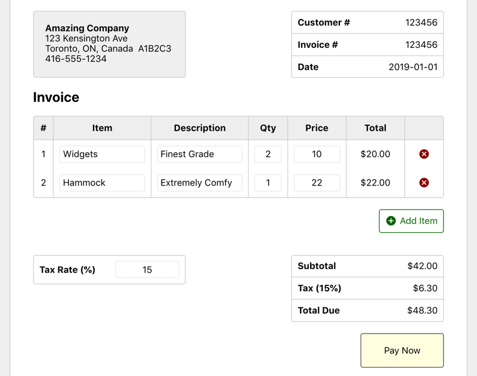
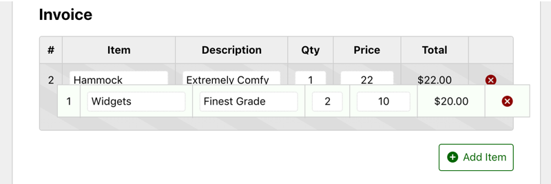

# React Simple Invoice

An example of an Invoice component built with React that enables users to create invoices.

Totals are updated automatically as the user types values into the form fields.

Live Demo: <http://demo.firxworx.com/react-simple-invoice/>

Features:

* Drag-and-drop reordering of invoice line items implemented with `react-beautiful-dnd`
* SCSS Modules and CSS grid for style/layout.
* SVG UI icons from `react-icons` (docs: <https://react-icons.netlify.com/#/icons/md>)

The project code relates to posts on my blog at <https://firxworx.com>.

The project was bootstrapped with [Create React App](https://github.com/facebook/create-react-app) v2.

## Preview Screenshots

Preview (cropped):

Drag and Drop:

## Scripts

To run the project locally in development mode, navigate to the project folder in your Terminal and run:

`yarn start`

Go to [http://localhost:3000](http://localhost:3000) to view it in the browser.

## License

MIT

## Author

Kevin Firko
@firxworx
<hello@firxworx.com>

December 2018
